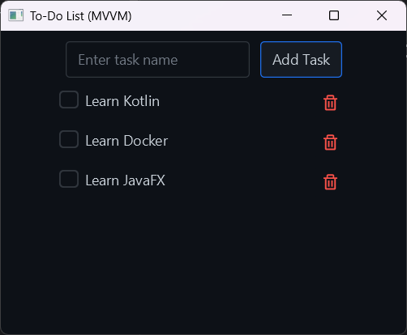

# Додаток To-Do List MVVM

Це простий додаток списку завдань, створений за допомогою JavaFX та архітектурного патерну MVVM (Model-View-ViewModel).



## Функціональність

- Додавання нових завдань
- Позначення завдань як виконаних
- Видалення завдань
- Чистий та сучасний інтерфейс з використанням теми AtlantaFX

## Використані технології

- Java 23
- JavaFX 22.0.1
- Maven
- AtlantaFX (UI компоненти та теми)
- Ikonli (набори іконок)

## Вимоги

- JDK 23 або новіше
- Maven 3.6 або новіше
- IntelliJ IDEA (рекомендовано)

## Запуск додатку

### Варіант 1: Використання командного рядка Maven

1. Клонуйте репозиторій:
   ```
   git clone <url-репозиторію>
   cd todolistmvvm
   ```

2. Запустіть додаток за допомогою Maven:
   ```
   mvn clean javafx:run
   ```

### Варіант 2: Використання IntelliJ IDEA з Maven

1. Відкрийте проєкт в IntelliJ IDEA
2. Створіть нову конфігурацію запуску Maven:
   - Перейдіть до **Run** → **Edit Configurations**
   - Натисніть кнопку **+** та виберіть **Maven**
   - Встановіть наступні параметри:
     - **Name**: JavaFX Maven Run
     - **Command line**: `javafx:run`
     - **Working directory**: Виберіть кореневу директорію проєкту
   - Натисніть **Apply** та **OK**
3. Запустіть конфігурацію, вибравши її з випадаючого списку конфігурацій та натиснувши кнопку запуску

### Варіант 3: Використання стандартної конфігурації запуску IntelliJ IDEA

1. Відкрийте проєкт в IntelliJ IDEA
2. Перейдіть до файлу `src/main/java/com/arakviel/todolistmvvm/Main.java`
3. Клацніть правою кнопкою миші на файлі та виберіть **Run 'Main.main()'**

## Структура проєкту

- `src/main/java/com/arakviel/todolistmvvm/`
  - `Main.java` - Точка входу в додаток
  - `model/` - Моделі даних
  - `view/` - Контролери та представлення UI
  - `viewmodel/` - View-моделі, що з'єднують UI з даними
  - `cellfactory/` - Користувацькі фабрики комірок для ListView

## Створення дистрибутивного пакету

Для створення дистрибутивного пакету:

```
mvn clean package
```

Запакований додаток буде доступний у директорії `target`.

## Ліцензія

[Додайте інформацію про ліцензію тут]
